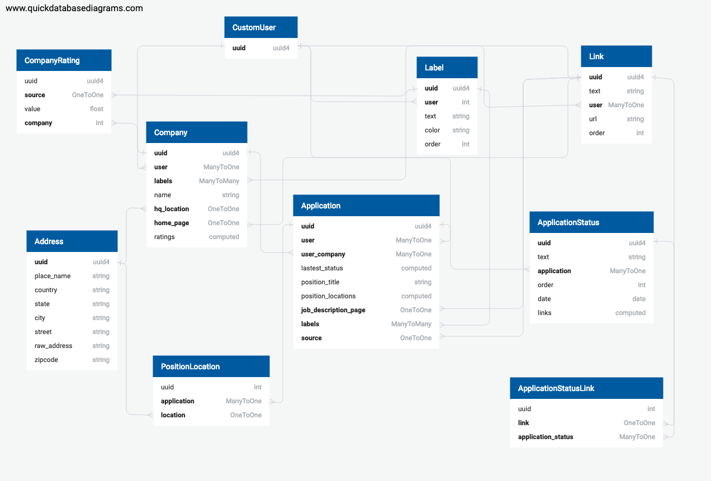

# REST API Server for appl-tracky

This is the backend repository for the web app, Appl Tracky, an Application Tracking System to help job finders ease their out-of-control spreadsheet use tracking every job application record. The frontend documentation for this app is in the [front end repo](https://github.com/rivernews/appl-tracky-spa).

You can also take a look at the dev diary (but they are pretty messy), quick notes and roadmaps in [doc for dev](docs).

## Overall Architecture

On the high level, the backend repository consists of several parts: 

- Django REST API server
- Nginx server that enables us to have more control over our server behavior and policy.
- Docker files for containerizing Django, Nginx and PostgreSQL database.
- Terraform script for provisioning AWS resources, in order to deploy docker image on AWS Elastic Container Service.
- Bash scripts to streamline deployment process by just one command.

## Challenges

### Handle Read/Write to Relationships

- One to one relationship

Django REST does not handle much about this out of the box. For read, it's not too complicated and we can just add fields in serializer. But for write, we have to overwrite `create()` and handle the object creation ourselves. Eventually, we are able to create resources for one-to-one relationships in Django, and having React send over all the data w/ the shape matching the data model in Django. I also need Django signal in order to handle object deletion and make sure related resources are deleted properly.

- Many to one relationship

Ultimately this will allow frontend to have dynamic form fields, but it also adds complexity to the backend. We have to first create the subject model object, then handle dynamic number of foreign-key-related object creation. By doing it in this order, we are able to propogate the correct foreign key values into database.

- Many to many relationship

This is a TODO.

- Generalizing - Writing Mixins or Base Models

When we are covering more data models to support one-to-one/many-to-one read/write, a lot of the pattern are repeating. In order to keep code DRY, we have to write a logic to gereneralize these operations. The base data model, base viewset and base serializer plays a big role in doing this generalization. This is crucial for development experience, because later on when supporting more data models to work with the REST API, these things will be already handled, and thus allows me to focus on more advanced features.

### Containerization & Continuous Delivery on AWS

The process of figuring out how to deploy docker images on AWS Elastic Container Service (ECS) is pretty rough. In order to spin up a working server, so many resources are involved - IAM, load balancer, target group, cluster, service, ...etc, and even domain name. Not to mention debugging unhealthy servers that resides in container on ECS.

I wrote a Medium post particularly to describe how some of the components work on AWS: [Protect your AWS ECS Service behind Application Load Balancer (ALB) and create them by Terraform](https://medium.com/@shaungc/protect-your-aws-ecs-service-behind-application-load-balancer-alb-and-create-them-by-terraform-6db816d329f7?source=friends_link&sk=a211b6bee8c4923ff7fde3e8f1f1397d).

## Database Schema Design

